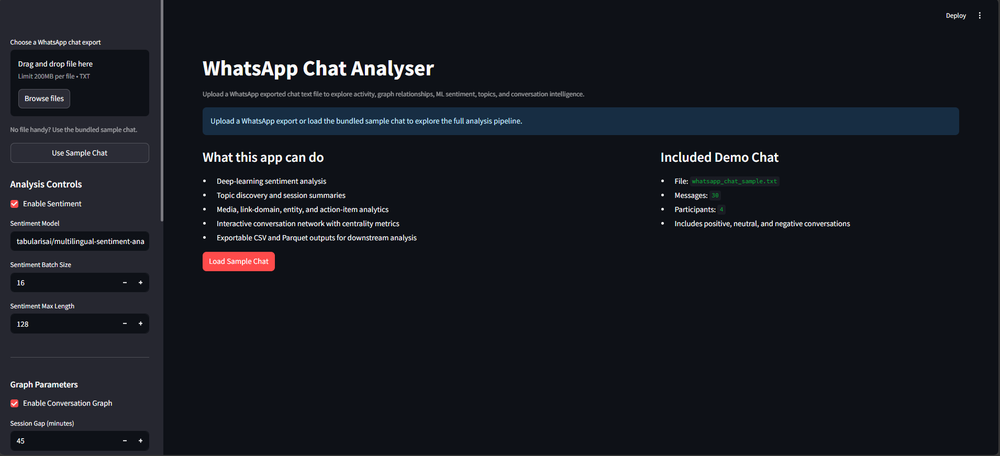
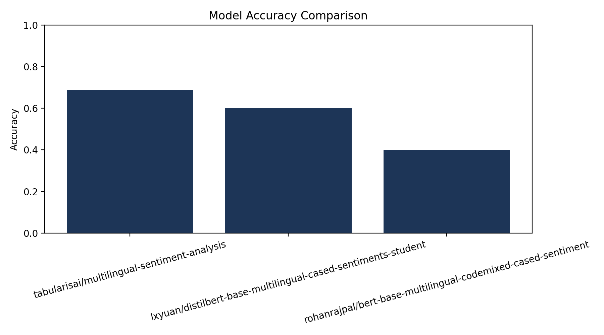
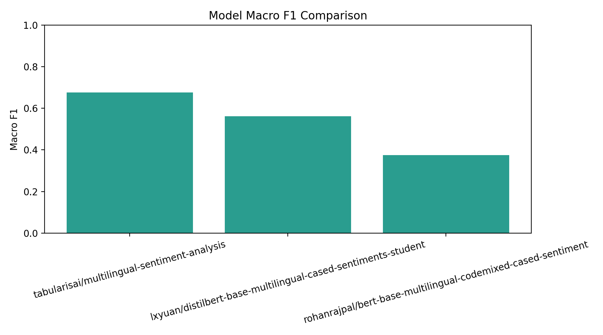
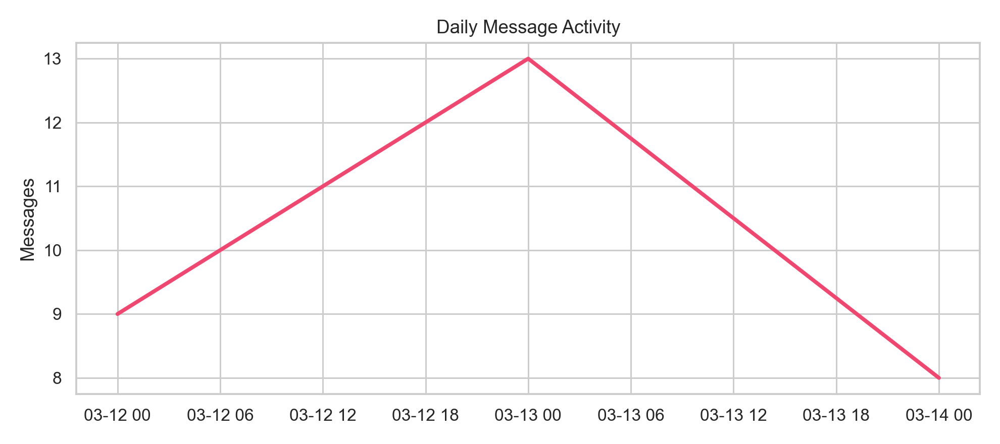
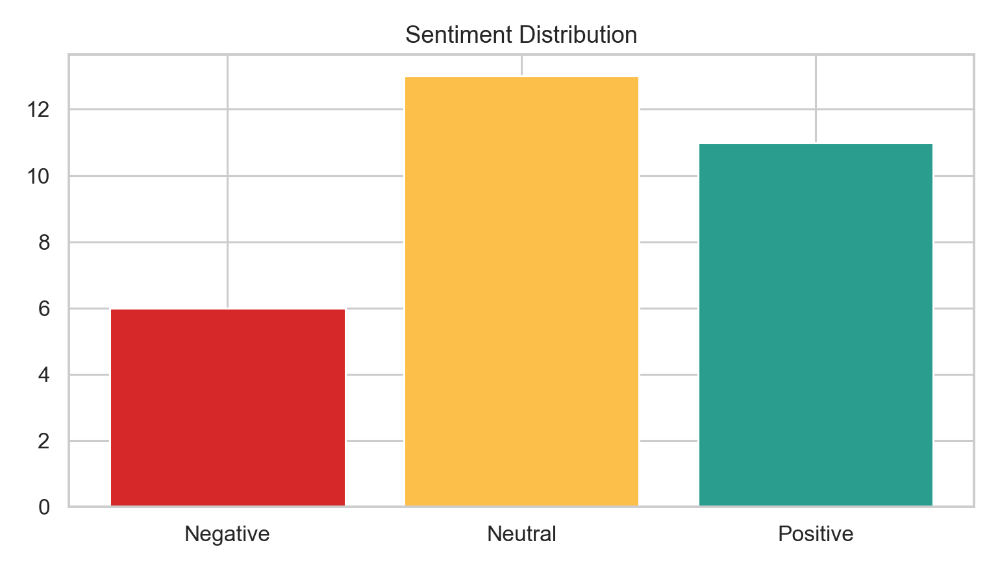
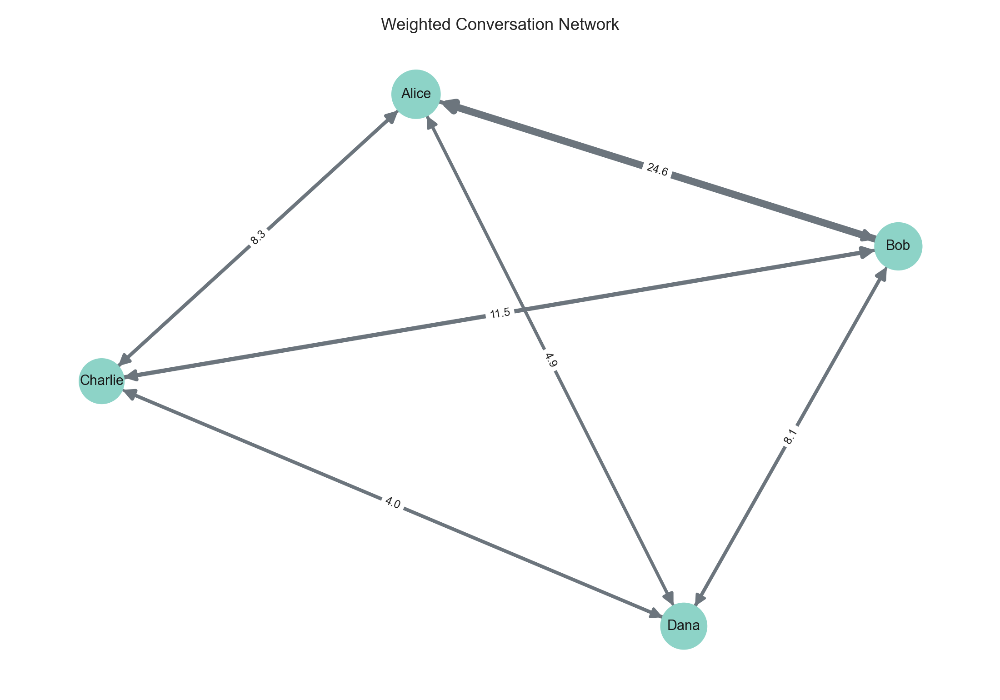
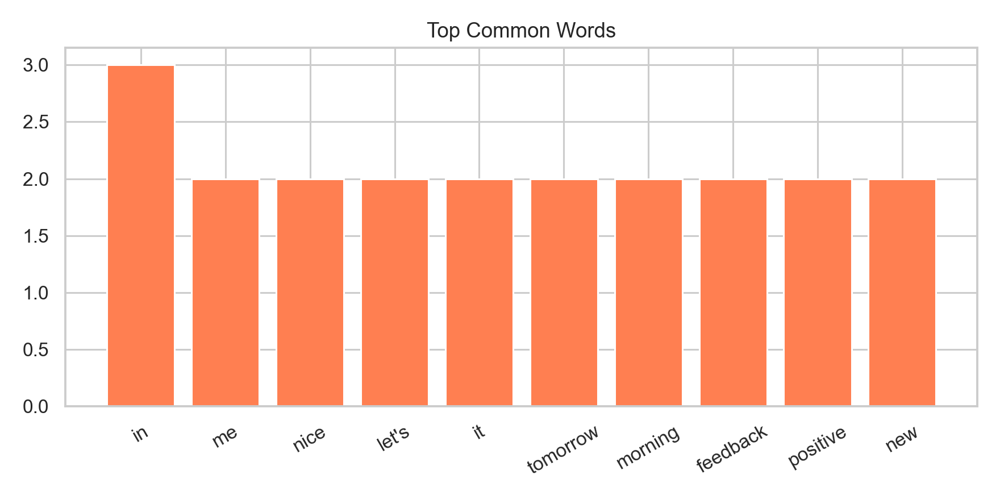

# Chat Intelligence Platform

Data-science-focused WhatsApp chat analysis project with a reusable `src/` pipeline, transformer-based sentiment analysis, and a weighted conversation network built for exploratory analysis and portfolio presentation.

## Dashboard Preview

AI-powered interactive dashboard for chat insights.


## Demo

- Notebook demo: [01_exploratory_analysis.ipynb](./notebooks/01_exploratory_analysis.ipynb)
- Benchmark report: [benchmark_report.md](./outputs/portfolio_benchmark/benchmark_report.md)
- Reproducibility notes: [docs/reproducibility.md](./docs/reproducibility.md)
- Methodology notes: [docs/methodology.md](./docs/methodology.md)

## Why This Project

This project started as a WhatsApp chat dashboard and was upgraded into a data-science-friendly repository that supports:

- modular offline analysis
- experiment-style model comparison
- exportable CSV and Parquet artifacts
- reproducible benchmarking
- portfolio-ready visuals and documentation

## Core Features

- WhatsApp export parser with support for multi-line messages and system messages
- `pandas`-based feature engineering for dates, periods, and activity maps
- deep-learning sentiment analysis using Hugging Face transformers
- weighted `networkx` conversation graph using reply gaps, mentions, and conversation clustering
- media analytics and link-domain analysis
- topic discovery using TF-IDF plus KMeans clustering
- lightweight entity and action-item extraction for deadlines, issues, and requests
- user behavior profiling for conversation starts, reply speed, questions, and links
- interactive graph visualization with Plotly
- experiment logging for reproducible runs
- Streamlit interface for quick interactive exploration
- CLI scripts for batch pipeline runs and sentiment benchmarking
- notebook and tests for reproducible analysis

## Methodology

### 1. Parsing and Structuring

Raw WhatsApp `.txt` exports are parsed into a structured DataFrame with:

- sender
- timestamp
- message text
- temporal features like day, month, hour, and period

### 2. Sentiment Analysis

Only user-authored text messages are passed into the sentiment pipeline. Group notifications, deleted messages, and media placeholders are excluded. The current default model is:

- [`tabularisai/multilingual-sentiment-analysis`](https://huggingface.co/tabularisai/multilingual-sentiment-analysis)

The benchmark also compares:

- [`lxyuan/distilbert-base-multilingual-cased-sentiments-student`](https://huggingface.co/lxyuan/distilbert-base-multilingual-cased-sentiments-student)
- [`rohanrajpal/bert-base-multilingual-codemixed-cased-sentiment`](https://huggingface.co/rohanrajpal/bert-base-multilingual-codemixed-cased-sentiment)

### 3. Relationship Graph

The relationship graph does not rely on naive next-message chaining. Edge weights combine:

- reply time gap
- direct mentions
- conversation-session proximity

This gives a more realistic proxy for conversation structure and participant interaction intensity.

### 4. Exports

All major artifacts can be exported as:

- CSV
- Parquet
- Markdown reports
- PNG portfolio figures

### 5. Extended Analytics

The current pipeline also includes:

- media type counts and user-wise media usage
- shared-link domain analysis
- topic clustering over chat messages
- session-level extractive summaries
- advanced network metrics such as density, reciprocity, clustering, PageRank, and betweenness

## Results

### Benchmark Summary

Benchmark dataset:

- file: [data/sample/sentiment_validation.csv](./data/sample/sentiment_validation.csv)
- rows: `45`
- labels: `Positive`, `Negative`, `Neutral`
- composition: mixed Hinglish and English validation examples

Model comparison results:

| Model | Accuracy | Macro F1 |
| --- | --- | --- |
| `tabularisai/multilingual-sentiment-analysis` | `0.6889` | `0.6762` |
| `lxyuan/distilbert-base-multilingual-cased-sentiments-student` | `0.6000` | `0.5619` |
| `rohanrajpal/bert-base-multilingual-codemixed-cased-sentiment` | `0.4000` | `0.3743` |

Selected default model:

- `tabularisai/multilingual-sentiment-analysis`

Selection rule:

- highest macro F1
- then highest accuracy

### Sample Chat Run

Pipeline sample run:

- dataset: [data/sample/whatsapp_chat_sample.txt](./data/sample/whatsapp_chat_sample.txt)
- total messages: `32`
- participants: `4`
- shared links: `1`
- media messages: `1`
- graph edges: `12`
- sentiment distribution: `19.35% negative`, `45.16% neutral`, `35.48% positive`

## Screenshots and Saved Figures

### Benchmark Accuracy



### Benchmark Macro F1



### Daily Message Activity



### Sentiment Distribution



### Conversation Network



### Top Common Words



## Project Structure

```text
.
├── app.py
├── config/
├── data/
├── docs/
├── notebooks/
├── outputs/
├── scripts/
├── src/chat_analyser/
└── tests/
```

## How To Run

### Install

```powershell
python -m pip install -r requirements.txt
python -m pip install -r requirements-dev.txt
```

### Run the Streamlit App

```powershell
streamlit run app.py
```

### Run with Docker

```powershell
docker build -t whatsapp-chat-analyser .
docker run -p 8501:8501 whatsapp-chat-analyser
```

### Run the Analysis Pipeline

```powershell
python scripts\run_pipeline.py --chat-file data\sample\whatsapp_chat_sample.txt --output-dir outputs\portfolio_pipeline
```

### Run the Sentiment Benchmark

```powershell
python scripts\evaluate_models.py --dataset data\sample\sentiment_validation.csv --output-dir outputs\portfolio_benchmark
```

### Generate README Figures

```powershell
python scripts\generate_portfolio_assets.py
```

### Run Tests

```powershell
pytest -q
```

## Reproducibility and Experiment Tracking

This repository includes:

- fixed project structure in `src/`
- configurable runtime settings in [config/defaults.json](./config/defaults.json)
- saved benchmark outputs in [outputs/portfolio_benchmark](./outputs/portfolio_benchmark)
- saved pipeline exports in [outputs/portfolio_pipeline](./outputs/portfolio_pipeline)
- JSONL experiment logs in `outputs/experiment_tracking`
- repeatable commands in [docs/reproducibility.md](./docs/reproducibility.md)

## Portfolio Highlights

This project demonstrates:

- NLP pipeline design with `transformers`
- graph analytics with `networkx`
- experimental benchmarking and model selection
- export-oriented data workflows with `pandas` and `pyarrow`
- storytelling through notebooks, figures, and documentation
